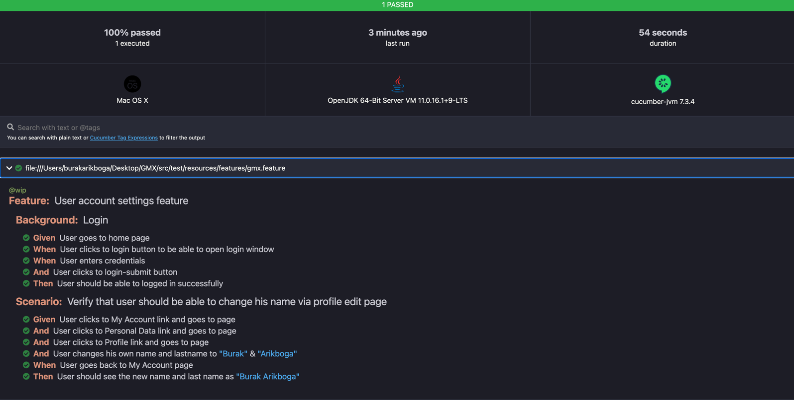

## **GMX-MAIL** - _Documentation of Test Cases_

This project has been created for answering the case study problems from `GMX_MAIL` by `ARIKBOGA` from scratch and as a
Cucumber-Junit project.

* The `2` study tasks which are requested on [GMX_MAIL](https://mail.com/) have been
  created by using Selenium-Cucumber-JUnit and Java and their automation steps have been completed.

* The TASK_1 test cases/steps and data's can be found and seen under the `~``src/test/resources/features``~` directory and their JAVA codes can be found under `~``src/test/java/task_1/com/gmx/step_definitions``~`

* The TASK_2 solution can be found under `~``src/main/java/task_2/Task_2.java``~` and it's **UNIT** test cases also can be found under  `~``src/test/java/task_2/Task_2Test.java``~`

* These test cases can be connected with **`JIRA`** by using `tags` such as `smoke & regression & wip` and any event can be
  updated by using `cucumber-json` report exporting from the framework to the JIRA.
  All kind of reports generated by `Cucumber-report` tools automatically after each test running.

* For business level understanding and making the things easy to follow by the other teammates, the `Cucumber Gherkin`
  files and `Cucumber report` process have been used in this project. Please check under the `target` directory for the
  reports(XML, JSON, HTML).
  
  * Example screenshot of HTML report: 

* The **parallel** execution infrastructure has been created using `maven-surefire` plugin in the `pom.xml` file in
  order to run the test of the project entirely and based on the gherkin(feature) files.

* The maven dependency of `boni-garcia` has been used to get capability to access all drivers of the currently installed versions of
  browsers

* By using the method of reading data from the file, it is possible to test it in different browsers. 
  When the browser name in the file is changed to the browser name in which the tests are requested to run, the tests will run in that browser. 
  The browser to be used **must be installed** on the computer where the tests will be run. Please check the `configuration.properties` file.

* On the other hand, The project has been built by using **Maven** so that we will have an opportunity to inject our test suit in a **CI/CD** pipeline and run it on the remote with **CLI** commands. 

  * Ex:  `mvn test -Dbrowser=firefox` : Despite the browser value in the configuration.properties file is `chrome`, the test cases will be run on `Firefox` browser thanks to this **System environment setter** command.

* The creation of the java files under the `utilities` package and the structures in them are entirely owned by the
  creator of this project.

* More detailed explanation and explanation will be provided upon request.

### King Regards.